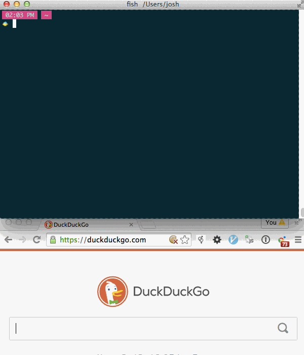

One tactic that I use to deal with big complex environments I'm trying to learn
is to isolate them. If I'm confused about something that isn't working, I repeatedly
remove all the context that's just getting in the way and making it harder to understand.
Once I understand each of the pieces in isolation, then I can begin integrating
them together again, seeing how they fit. This means you get to understand each piece,
how it works, what it does, and then, after you have that foundation,
you can see how it interacts with all the context.

Here are some ways to do that in Rails:

## Models / Migrations / Database

There is a SeeingIsBelieving snippet to get a
sqlite database configured with ActiveRecord.

Screencap: 

Steps:

1. Open a new window in your editor
2. Set the language to Ruby
3. Type `s_arb`
4. Press tab
5. Run SeeingIsBelieving

Getting comfortable with it:

* Try changing a column in the migration area.
* Try adding a validation in the model area.
* Try Querying first for the post, then getting the user from it.
* Copy your schema.rb into the migration area
* Copy your models into the model area (you can paste all these pieces into one file)

Ways to use it:

* Figuring out how to write a query you aren't sure about.
* Start here, and flesh out your schema and models,
  making sure it allows you to query all the data you want,
  and supports your use cases. Then, when you're satisfied with it,
  make a new migration, and paste it into the migration,
  and paste the models into the files they go into.

## ERB

Play with most ERB all by itself (it [doesn't work]([only it can't parse](https://gist.github.com/JoshCheek/2dfffcafc5c14d5c1323))
with some of Rails' erb).

```ruby
require 'erb'

@mah_var = 123
erb = ERB.new('pre <%= @mah_var %> post')

# see the result, our binding allows it to see our instance variables
erb.result(binding) # => "pre 123 post"

# see the Ruby code that ERB compiled to
puts erb.src.gsub(/; /, "\n")

# >> #coding:UTF-8
# >> _erbout = ''
# >> _erbout.concat "pre "
# >> _erbout.concat(( @mah_var ).to_s)
# >> _erbout.concat " post"
# >> _erbout.force_encoding(__ENCODING__)
```


### Getting comfortable with it

Try setting the variable `@names = ['Sam', 'Sally', 'Sarah']`,
can you get it to generate this html? (don't worry about whitespace,
html doesn't care about that)

```html
<ul>
  <li>Sam</li>
  <li>Sally</li>
  <li>Sarah</li>
<ul>
```


### Isolating view issues

If you have a problem with what your view is generating,
(e.g. you see a big object being printed), then:

* Copy the whole view into the document.
* **Tip:** you can make a string using a "here document"
  This allows you to choose a phrase that indicates the end of the string,
  so that single and double quotes don't mess it up.

  ```ruby
  html_erb = <<-ZOMG
  "Double quotes!"
  'Single quotes!'
  ZOMG

  html_erb # => "\"Double quotes!\"\n\"Single quotes!\"\n"
  ```
* Delete portions of the view that don't matter for this exploration.
  (i.e. everything before and after the broken bit, everything within it that
  you can ignore)
* Before you run it, create the variables it is using.
  You don't need real ActiveRecord objects, you can make a simple class,
  so long as it has the expected methods.
* If you're struggling to figure out how to do that, you can combine it
  with the ActiveRecord snippet above: [https://gist.github.com/JoshCheek/6dfdb2311de94601720f](https://gist.github.com/JoshCheek/6dfdb2311de94601720f)


## Playing with ActiveSupport

Are you manipulating dates in the middle of a model somewhere?
You can get that context by itself just to make sure you understand
how dates work:

```ruby
require 'active_support/all'
1.day.ago # => 2015-04-23 14:36:17 -0600
```

Here is a big list of methods you can play with:

```ruby
$LOADED_FEATURES
  .grep(/activesupport.*?core_ext/)
  .each { |path|
    puts "=====  #{path}  ====="
    puts File.read(path).lines.map.grep(/^ *(class|module|def)/)
    puts
  }

# >> ...etc...
# >> =====  /Users/josh/.gem/ruby/2.1.1/gems/activesupport-4.2.1/lib/active_support/core_ext/date_and_time/calculations.rb  =====
# >> module DateAndTime
# >>   module Calculations
# >>     def yesterday
# >>     def tomorrow
# >>     def today?
# >>     def past?
# >>     def future?
# >>     def days_ago(days)
# >> ...etc...
```


## View helpers

Be able to call the view helpers:

```ruby
require 'action_view'       # load the code
extend ActionView::Helpers  # put the module in main's ancestry so we can call its methods
number_to_currency 1234     # => "$1,234.00"
```

What helper modules are available? What are their methods?

```ruby
require 'action_view'
module ActionView::Helpers
  constants.grep(/Helper$/).sort.each do |name|
    methodnames = ActionView::Helpers.const_get(name).instance_methods
    puts "#{self}::#{name}", methodnames.map { |m| "  #{m}" }.sort.join("\n")
  end
end

# >> ...etc...
# >> ActionView::Helpers::NumberHelper
# >>   number_to_currency   <-- this is how we know to use ActionView::Helpers
# >>   number_to_human
# >>   number_to_human_size
# >> ...etc...
```


## Validations

Here is a way to play with validations to see what they do:

```ruby
require 'active_model'  # => true

class Person
  include ActiveModel::Model  # => Person

  attr_accessor :name          # => nil
  validates_presence_of :name  # => [ActiveModel::Validations::PresenceValidator]
end                            # => [ActiveModel::Validations::PresenceValidator]

Person.new(name: 'DHHaroni').valid?  # => true
noone = Person.new                   # => #<Person:0x007f99a19c16b0>
noone.valid?                         # => false
noone.errors                         # => #<ActiveModel::Errors:0x007f99a19c1480 @base=#<Person:0x007f99a19c16b0 @validation_context=nil, @errors=#<ActiveModel::Errors:0x007f99a19c1480 ...>>, @messages={:name=>["can't be blank"]}>
     .full_messages                  # => ["Name can't be blank"]
```

## Routes and URL Helpers

Need to play with the Routing DSL to see what methods it ultimately gives you?
Not sure what helper method will access that route?

```ruby
# Run these with `command + option + n`, otherwise, they are hard to see.
require 'action_dispatch/routing'
route_set = ::ActionDispatch::Routing::RouteSet.new
route_set.draw do
  root 'site#index'
  resources :ducks, only: [:index, :show] do
    member { get :pond }
  end
end

# =====  Rake Routes output  =====
require 'action_dispatch/routing/inspector'
Rails ||= Class.new { def self.method_missing(*) self end } # hack to get around router coupling
ActionDispatch::Routing::RoutesInspector.new(route_set.routes).format(ActionDispatch::Routing::ConsoleFormatter.new).lines.map(&:chomp)
# => ["   Prefix Verb URI Pattern               Controller#Action",
#     "     root GET  /                         site#index",
#     "pond_duck GET  /ducks/:id/pond(.:format) ducks#pond",
#     "    ducks GET  /ducks(.:format)          ducks#index",
#     "     duck GET  /ducks/:id(.:format)      ducks#show"]

# =====  Helper Methods  =====
# you can call these in your view, controller, and some tests (controller and feature tests, I believe)
route_set.url_helpers.instance_methods.sort
# => [:_routes,
#     :duck_path,
#     :duck_url,
#     :ducks_path,
#     :ducks_url,
#     :pond_duck_path,
#     :pond_duck_url,
#     :root_path,
#     :root_url]
```

[Here](https://gist.github.com/JoshCheek/fae6b046dd9f6bcd1dbf) is also a longer
snippet that will tell you additional information like the exact name of the
controller it will look for, and where on the file system it will look.


## Query Parameters and Form Names

Ever had to build the name of the form element yourself? You're struggling
to remember "Is it `user[]name` or `user[name]`"... Well, form names are
typically encoded the same as URLS, and we can see how Rails parses them with this:

```ruby
require 'rack/utils'

def to_params(query_string)
  Rack::Utils.parse_nested_query query_string
end

def from_params(params)
  Rack::Utils.build_nested_query params
end

to_params 'users[id]=12'                # => {"users"=>{"id"=>"12"}}
to_params 'a=1&b=2&c[d]=e&f[]=g&f[]=h'  # => {"a"=>"1", "b"=>"2", "c"=>{"d"=>"e"}, "f"=>["g", "h"]}
to_params(
  from_params(books: [{title: 'Beyond Good And Evil'}, {title: 'The Little Book Of Talent'}])
  # => "books[][title]=Beyond+Good+And+Evil&books[][title]=The+Little+Book+Of+Talent"
) # => {"books"=>[{"title"=>"Beyond Good And Evil"}, {"title"=>"The Little Book Of Talent"}]}
```

## Escaping / Unescaping in the URL

```ruby
require 'rack/utils'

def escape_path(text)
  Rack::Utils.escape_path text
end

def unescape_path(text)
  Rack::Utils.unescape text
end

escape_path   "Hello, world!"       # => "Hello%2C%20world%21"
unescape_path "Hello%2C%20world%21" # => "Hello, world!"
```


## Escaping / Unescaping in HTML

```ruby
require 'rack/utils'
def escape_html(text)
  Rack::Utils.escape_html text
end

def unescape_html(text)
  unescape_html    = Rack::Utils::ESCAPE_HTML.invert
  unescape_pattern = Regexp.union(*unescape_html.keys)
  text.gsub(unescape_pattern) { |c| unescape_html[c] }
end

escape_html   '<script>'       # => "&lt;script&gt;"
unescape_html "&lt;script&gt;" # => "<script>"
```


## All the status codes

```ruby
require 'rack/utils'
Rack::Utils::HTTP_STATUS_CODES
# => {100=>"Continue",
#     101=>"Switching Protocols",
#     102=>"Processing",
#     200=>"OK",
#     ...
#     404=>"Not Found",
#     ...
#     500=>"Internal Server Error",
#     ...
```


## CSS Selectors

There is a builtin snippet `s_nokogiri` that will give you output like this:

```ruby
require 'nokogiri'

doc = Nokogiri::HTML(<<-HTML)
  <!DOCTYPE html>
  <html>
    <head>
      <meta http-equiv="Content-type" content="text/html; charset=utf-8">
      <title>OMG</title>
    </head>
    <body>
      <ul>
        <li>a</li>
        <li>b</li>
        <li>c</li>
      </ul>
    </body>
  </html>
HTML

doc.at_css('ul li:nth-child(2)') # => #<Nokogiri::XML::Element:0x3ff8d50b9524 name="li" children=[#<Nokogiri::XML::Text:0x3ff8d50b92e0 "b">]>
   .text                         # => "b"
```

You can drop your html into there and practice crafting the selector that targets it :)


## Forms

This one gets rough, because it uses a lot more of the environment.
Here, we've included the routes snippet from above, to allow us to specify them.

```ruby
# =====  Fake out the env  =====
class << self
  require 'action_view'
  require 'active_support/all'
  require 'action_dispatch/routing/polymorphic_routes'

  include ActionView::Helpers::FormHelper
  include ActionView::Helpers::FormTagHelper
  include ActionView::Helpers
  include ActionDispatch::Routing::PolymorphicRoutes

  attr_accessor :output_buffer # apparently views have this method, and it's fine for it to return nil
  def protect_against_forgery? # causes it to not try and put the token in the form, b/c that causes it to use tons of other methods I don't have
    false
  end

  require 'action_dispatch/routing'
  route_set = ::ActionDispatch::Routing::RouteSet.new
  route_set.draw do
    resources :people # <------------------ put your routes here
  end
  include route_set.url_helpers
end


# =====  A class we can put in our form  =====
require 'active_model'
class Person
  include ActiveModel::Model
  attr_accessor :name, :age
  validates_presence_of :name
end


# =====  Render the form  =====
@person = Person.new(name: 'Sally', age: 72)

puts ActionView::Template::Handlers::Erubis.new(<<-HTML).result
<%= form_for(@person) do |f| %>
  <% if @person.errors.any? %>
    <div id="error_explanation">
      <h2><%= pluralize(@person.errors.count, "error") %> prohibited this pizza from being saved:</h2>

      <ul>
      <% @person.errors.full_messages.each do |message| %>
        <li><%= message %></li>
      <% end %>
      </ul>
    </div>
  <% end %>

  <div class="field">
    <%= f.label :name %><br>
    <%= f.text_field :name %>
  </div>
  <div class="field">
    <%= f.label :age %><br>
    <%= f.number_field :age %>
  </div>
  <div class="actions">
    <%= f.submit %>
  </div>
<% end %>
HTML

# >> <form class="new_person" id="new_person" action="/people" accept-charset="UTF-8" method="post"><input name="utf8" type="hidden" value="&#x2713;" />
# >>
# >>   <div class="field">
# >>     <label for="person_name">Name</label><br>
# >>     <input type="text" value="Sally" name="person[name]" id="person_name" />
# >>   </div>
# >>   <div class="field">
# >>     <label for="person_age">Age</label><br>
# >>     <input type="number" value="72" name="person[age]" id="person_age" />
# >>   </div>
# >>   <div class="actions">
# >>     <input type="submit" name="commit" value="Create Person" />
# >>   </div>
# >> </form>
```

## A complete Rails App!

This is a Rails app that would be generated from scratch, with a scaffold for a User with a name.
I've modified the controller slightly. The views are defined Sinatra style, at the end of the file,
after the `__END__`. There is a bit of code to wire that into place.

This joins many of the snippets above into a complete Rails app. There are places for:

* Configuration
* Initializers
* Secrets
* Migrations / Schema
* Models
* Routes
* Controllers (I modified the default scaffolding to remove implicit variable setting, since I fkn hate that)
* Seed Data
* Capybara interacting with the app (testing / interacting like you would in a browser)
* Logs
* Views


```ruby
gem 'rails', '4.2.1' # prob works on others, too, but this is the one I figured it out on
require "rails"
require 'active_record'
require 'action_controller/railtie'
require 'action_view/railtie'

# =====  Configuration  =====
require 'stringio'
$stdout      = StringIO.new
Rails.logger = ActiveRecord::Base.logger = Logger.new $stdout
ActiveSupport::LogSubscriber.colorize_logging = false

class MahApp < Rails::Application
  # config/application.rb and config/environments/*.rb
  config.cache_classes               = true
  config.eager_load                  = false
  config.consider_all_requests_local = true
  config.serve_static_files          = false
  config.assets.debug                = true

  # config/initializers/*.rb
  config.session_store :cookie_store, key: '_mah_app_session'

  # config/secrets.yml
  secrets.secret_key_base = "ffaaf61864e14edf3496df94a3ec3a24050495a0dcc8727dba1ebc7cf6594616479c741329a066ce5387fdf9d0205bfebb8a9549cc4d314c6738e62ad3fda676"

  # config/environment.rb
  initialize!
end


# =====  Schema / Migrations  =====
ActiveRecord::Base.establish_connection adapter: 'sqlite3', database: ':memory:'

ActiveRecord::Schema.define do
  self.verbose = true

  create_table :users do |t|
    t.string :name
  end
end


# =====  Models  =====
class User < ActiveRecord::Base
  validates_presence_of :name
end


# =====  Routes  =====
Rails.application.routes.draw do
  resources :users
  root 'site#index'
end

ActionDispatch::Routing::RoutesInspector.new(Rails.application.routes.routes).format(ActionDispatch::Routing::ConsoleFormatter.new).lines.map(&:chomp)
# => ["   Prefix Verb   URI Pattern               Controller#Action",
#     "    users GET    /users(.:format)          users#index",
#     "          POST   /users(.:format)          users#create",
#     " new_user GET    /users/new(.:format)      users#new",
#     "edit_user GET    /users/:id/edit(.:format) users#edit",
#     "     user GET    /users/:id(.:format)      users#show",
#     "          PATCH  /users/:id(.:format)      users#update",
#     "          PUT    /users/:id(.:format)      users#update",
#     "          DELETE /users/:id(.:format)      users#destroy",
#     "     root GET    /                         site#index"]


# =====  Wire Views Up To The DATA Segment @ The End Of The File  =====
# This is just some wiring to make this setup work, you probably don't need to edit it,
# unless it breaks (not unlikely, it probably makes use of volatile knowledge,
# as things at this layer are very coupled and thus fragile.
# Which is also why it took 4 hours to figure out)
class ActionView::LookupContext
  def view_paths=(paths)
    @view_paths = EndOfFileTemplates.new
  end
end

class EndOfFileTemplates
  TEMPLATES = DATA.slice_before { |line| line.start_with? '@@' }
                  .each_with_object({}) { |(declaration, *rest), templates|
                    declaration =~ /^@@\s*(.*?)\.html\.(.*?)\s*$/
                    handler       = ActionView::Template.handler_for_extension $2
                    templates[$1] = ActionView::Template.new(rest.join, declaration.strip, handler, {})
                  }

  def find_all(name, prefixes, partial, *)
    name = "_#{name}" if partial
    [prefixes, name]  # => [["users", "application"], "index"], [["layouts"], "users"], [["layouts"], "application"], [["users", "application"], "new"], [["layouts"], "users"], [["layouts"], "application"], [["users", "application"], "_form"], [["users", "application"], "show"], [["layouts"], "users"], [["layouts"], "application"]
    prefixes.map { |prefix| TEMPLATES[File.join(prefix, name)] }.compact
  end

  def find(*args)
    find_all(*args).first || raise(MissingTemplate.new(self, *args))
  end

  def exists?(path, prefixes, *args)
    find_all(path, prefixes, *args).any?
  end
end


# =====  Controllers  =====
class ApplicationController < ActionController::Base
  protect_from_forgery with: :exception
end

class SiteController < ApplicationController
  def index
    redirect_to users_path
  end
end

class UsersController < ApplicationController
  def index
    @users = User.all
  end

  def show
    @user = User.find params[:id]
  end

  def new
    @user = User.new
  end

  def edit
    @user = User.find params[:id]
  end

  def create
    params
    # => {"utf8"=>"✓",
    #     "authenticity_token"=>
    #      "Ej/iwrH3EIAwHtpaKXPev355fswddh4emp6wFMFMuh8Ru9k2plreK9rJ6VG4hFmBT2Ei/d6fWTcDeDKuBGGtvg==",
    #     "user"=>{"name"=>"Lilith"},
    #     "commit"=>"Create User",
    #     "controller"=>"users",
    #     "action"=>"create"}
    user_params # => {"name"=>"Lilith"}
    @user = User.new user_params
    if @user.save
      redirect_to @user, notice: 'User was successfully created.'
    else
      render :new
    end
  end

  def update
    @user = User.find params[:id]
    if @user.update user_params
      redirect_to @user, notice: 'User was successfully updated.'
    else
      render :edit
    end
  end

  def destroy
    @user = User.find params[:id]
    @user.destroy
    redirect_to users_url, notice: 'User was successfully destroyed.'
  end

  private

  def user_params
    params.require(:user).permit(:name)
  end
end


# =====  Seed Data  =====
User.create! name: 'Kirsty'
User.create! name: 'Savannah'


# =====  Use The App (Tests / Browser)  =====
require 'capybara'
Capybara.app = Rails.application
session = Capybara.current_session

# visit root, follow redirect to users path
session.visit('/')
session.current_url                                # => "http://www.example.com/users"
session.status_code                                # => 200
session.all('table tr td:first-child').map(&:text) # => ["Kirsty", "Savannah"]

# click link to get new user form
session.click_on 'New User'
session.current_url # => "http://www.example.com/users/new"

# create the new user, verify by checking the db
session.fill_in 'Name', with: 'Lilith'
User.pluck :name  # => ["Kirsty", "Savannah"]
session.click_on 'Create User'
User.pluck :name  # => ["Kirsty", "Savannah", "Lilith"]

# should have redirect to the show
session.current_url # => "http://www.example.com/users/3"


# =====  Logs  =====
printed = $stdout.string
printed.define_singleton_method(:inspect) { printed } # trick SiB into displaying it prettily
printed
# => -- create_table(:users)
#    D, [2015-04-27T00:10:19.687961 #90045] DEBUG -- :    (0.3ms)  CREATE TABLE "users" ("id" INTEGER PRIMARY KEY AUTOINCREMENT NOT NULL, "name" varchar)
#       -> 0.0025s
#    D, [2015-04-27T00:10:19.912840 #90045] DEBUG -- :    (0.0ms)  begin transaction
#    D, [2015-04-27T00:10:19.916399 #90045] DEBUG -- :   SQL (0.1ms)  INSERT INTO "users" ("name") VALUES (?)  [["name", "Kirsty"]]
#    D, [2015-04-27T00:10:19.916650 #90045] DEBUG -- :    (0.0ms)  commit transaction
#    D, [2015-04-27T00:10:19.916880 #90045] DEBUG -- :    (0.0ms)  begin transaction
#    D, [2015-04-27T00:10:19.917237 #90045] DEBUG -- :   SQL (0.0ms)  INSERT INTO "users" ("name") VALUES (?)  [["name", "Savannah"]]
#    D, [2015-04-27T00:10:19.917388 #90045] DEBUG -- :    (0.0ms)  commit transaction
#    D, [2015-04-27T00:10:20.125513 #90045] DEBUG -- :
#    D, [2015-04-27T00:10:20.125546 #90045] DEBUG -- :
#    I, [2015-04-27T00:10:20.125743 #90045]  INFO -- : Started GET "/" for 127.0.0.1 at 2015-04-27 00:10:20 -0600
#    I, [2015-04-27T00:10:20.128161 #90045]  INFO -- : Processing by SiteController#index as HTML
#    I, [2015-04-27T00:10:20.128532 #90045]  INFO -- : Redirected to http://www.example.com/users
#    I, [2015-04-27T00:10:20.128591 #90045]  INFO -- : Completed 302 Found in 0ms
#    D, [2015-04-27T00:10:20.129037 #90045] DEBUG -- :
#    D, [2015-04-27T00:10:20.129052 #90045] DEBUG -- :
#    I, [2015-04-27T00:10:20.129083 #90045]  INFO -- : Started GET "/users" for 127.0.0.1 at 2015-04-27 00:10:20 -0600
#    I, [2015-04-27T00:10:20.129927 #90045]  INFO -- : Processing by UsersController#index as HTML
#    D, [2015-04-27T00:10:20.141497 #90045] DEBUG -- :   User Load (0.1ms)  SELECT "users".* FROM "users"
#    I, [2015-04-27T00:10:20.143230 #90045]  INFO -- :   Rendered @@ users/index.html.erb (10.6ms)
#    I, [2015-04-27T00:10:20.143928 #90045]  INFO -- : Completed 200 OK in 14ms (Views: 13.8ms)
#    D, [2015-04-27T00:10:20.147256 #90045] DEBUG -- :
#    D, [2015-04-27T00:10:20.147296 #90045] DEBUG -- :
#    I, [2015-04-27T00:10:20.147347 #90045]  INFO -- : Started GET "/users/new" for 127.0.0.1 at 2015-04-27 00:10:20 -0600
#    I, [2015-04-27T00:10:20.147867 #90045]  INFO -- : Processing by UsersController#new as HTML
#    I, [2015-04-27T00:10:20.158708 #90045]  INFO -- :   Rendered @@ users/_form.html.erb (8.4ms)
#    I, [2015-04-27T00:10:20.158824 #90045]  INFO -- :   Rendered @@ users/new.html.erb (10.6ms)
#    I, [2015-04-27T00:10:20.159132 #90045]  INFO -- : Completed 200 OK in 11ms (Views: 11.1ms)
#    D, [2015-04-27T00:10:20.161014 #90045] DEBUG -- :    (0.1ms)  SELECT "users"."name" FROM "users"
#    D, [2015-04-27T00:10:20.163981 #90045] DEBUG -- :
#    D, [2015-04-27T00:10:20.164005 #90045] DEBUG -- :
#    I, [2015-04-27T00:10:20.164050 #90045]  INFO -- : Started POST "/users" for 127.0.0.1 at 2015-04-27 00:10:20 -0600
#    I, [2015-04-27T00:10:20.164517 #90045]  INFO -- : Processing by UsersController#create as HTML
#    I, [2015-04-27T00:10:20.164553 #90045]  INFO -- :   Parameters: {"utf8"=>"✓", "authenticity_token"=>"Ej/iwrH3EIAwHtpaKXPev355fswddh4emp6wFMFMuh8Ru9k2plreK9rJ6VG4hFmBT2Ei/d6fWTcDeDKuBGGtvg==", "user"=>{"name"=>"Lilith"}, "commit"=>"Create User"}
#    D, [2015-04-27T00:10:20.165587 #90045] DEBUG -- :    (0.1ms)  begin transaction
#    D, [2015-04-27T00:10:20.166082 #90045] DEBUG -- :   SQL (0.1ms)  INSERT INTO "users" ("name") VALUES (?)  [["name", "Lilith"]]
#    D, [2015-04-27T00:10:20.166266 #90045] DEBUG -- :    (0.0ms)  commit transaction
#    I, [2015-04-27T00:10:20.166679 #90045]  INFO -- : Redirected to http://www.example.com/users/3
#    I, [2015-04-27T00:10:20.166728 #90045]  INFO -- : Completed 302 Found in 2ms
#    D, [2015-04-27T00:10:20.167405 #90045] DEBUG -- :
#    D, [2015-04-27T00:10:20.167422 #90045] DEBUG -- :
#    I, [2015-04-27T00:10:20.167461 #90045]  INFO -- : Started GET "/users/3" for 127.0.0.1 at 2015-04-27 00:10:20 -0600
#    I, [2015-04-27T00:10:20.167791 #90045]  INFO -- : Processing by UsersController#show as HTML
#    I, [2015-04-27T00:10:20.167811 #90045]  INFO -- :   Parameters: {"id"=>"3"}
#    D, [2015-04-27T00:10:20.183235 #90045] DEBUG -- :   User Load (0.2ms)  SELECT  "users".* FROM "users" WHERE "users"."id" = ? LIMIT 1  [["id", 3]]
#    I, [2015-04-27T00:10:20.184874 #90045]  INFO -- :   Rendered @@ users/show.html.erb (1.1ms)
#    I, [2015-04-27T00:10:20.185323 #90045]  INFO -- : Completed 200 OK in 17ms (Views: 1.9ms)
#    D, [2015-04-27T00:10:20.186173 #90045] DEBUG -- :    (0.1ms)  SELECT "users"."name" FROM "users"


# =====  Views =====
# Placing them here at the end of the script so we can reference them conveniently.

__END__
@@ layouts/application.html.erb
  <!DOCTYPE html>
  <html>
  <head>
    <title>MahApp</title>
    <%= stylesheet_link_tag    'application', media: 'all', 'data-turbolinks-track' => true %>
    <%= javascript_include_tag 'application', 'data-turbolinks-track' => true %>
    <%= csrf_meta_tags %>
  </head>
  <body>

  <%= yield %>

  </body>
  </html>

@@ users/_form.html.erb
  <%= form_for(@user) do |f| %>
    <% if @user.errors.any? %>
      <div id="error_explanation">
        <h2><%= pluralize(@user.errors.count, "error") %> prohibited this user from being saved:</h2>

        <ul>
        <% @user.errors.full_messages.each do |message| %>
          <li><%= message %></li>
        <% end %>
        </ul>
      </div>
    <% end %>

    <div class="field">
      <%= f.label :name %><br>
      <%= f.text_field :name %>
    </div>
    <div class="actions">
      <%= f.submit %>
    </div>
  <% end %>


@@ users/show.html.erb
  <h1>Editing User</h1>

  <%= render 'form' %>

  <%= link_to 'Show', @user %> |
  <%= link_to 'Back', users_path %>


@@ users/index.html.erb
  <p id="notice"><%= notice %></p>

  <h1>Listing Users</h1>

  <table>
    <thead>
      <tr>
        <th>Name</th>
        <th colspan="3"></th>
      </tr>
    </thead>

    <tbody>
      <% @users.each do |user| %>
        <tr>
          <td><%= user.name %></td>
          <td><%= link_to 'Show', user %></td>
          <td><%= link_to 'Edit', edit_user_path(user) %></td>
          <td><%= link_to 'Destroy', user, method: :delete, data: { confirm: 'Are you sure?' } %></td>
        </tr>
      <% end %>
    </tbody>
  </table>

  <br>

  <%= link_to 'New User', new_user_path %>


@@ users/new.html.erb
  <h1>New User</h1>

  <%= render 'form' %>

  <%= link_to 'Back', users_path %>


@@ users/show.html.erb
  <p id="notice"><%= notice %></p>

  <p>
    <strong>Name:</strong>
    <%= @user.name %>
  </p>

  <%= link_to 'Edit', edit_user_path(@user) %> |
  <%= link_to 'Back', users_path %>
```


## Viewing a Raw HTTP Request

Here is a nice way to interact with HTTP that doesn't require any Ruby or Rails or anything.
All that stuff Rails gives you, it's to get a server that writes this stuff, at the end of the day.
And you can play with these things without any of it:



Some things to try:

* Redirect the browser (status code and Location header)
* Return some JSON (Content-Type, Content-Length headers, body)
* Try starting the server on a couple of different ports
* Set a cookie (forgot what the header is, I think it's "Set-Cookie", then make a second request and see that the browser sends you back the cookie you set)
* See how the path comes in (any request from the browser)
* See how query params come in (any request from the browser)
* See a form submission (edit any form on any page to point at your server -- another way is to start your Rails server,
  request the form, stop the server, start nc on that port, and then submit it)
* Decrypt a Rails session -- We can get the session from the cookie, and the secret_key_base from config/secrets.yml,
  these should be all we need, but I'd have to look into how the encryption is done.
* Render your own http response (probably have them write it independently, set the status, and the headers (Content-Type and Content-Length), and then paste the body in)
* Render arbitrary other headers and see that they are present in the browser (Network tab from dev Webkit's dev tools)
* Start nc on two different ports and redirect the browser from the one to the other, then you can see it come in twice.
* Often, a redirect url will be sent.

```shell
# A sever that will print the web request
$ nc -l 8889

# In a separate console, you can make a POST request
$ curl localhost:8889

# Make a POST request. The data you set with -d mimic the data a form would set.
$ curl localhost:8889 -d key=value -d another-data-key=another-value

# A more familiar way to see a POST request would be to render a form,
# fill it in with a browser, and submit the form to see a POST request.
```


## Viewing a Raw HTTP Response

You might also try placing a pry into here,
and changing the values of the variables to see that setting these things causes the browser
to do whatever you've told it to.

```shell
# A simple server that you can access to play with values and see what happens
ruby -r rack -e '
Rack::Server.start app: lambda { |env|
  status  = 200
  headers = {"Some-Header" => "some value", "Content-Type" => "text/plain"}
  body    = "Hello, world!"
  [status, headers, body.lines]
}'

# In a different window, View the response from this server
# -i means to include headers, -s is "silent" aka no progress bar
$ curl -i -s localhost:8080

# View response headers only
$ curl -is www.google.com | ruby -pe 'exit if /^\r\n$/'

# You can also open the dev tools in your browser and view this information
```


## What is an IP address?

I don't fully grasp all of this stuff, but I think that seeing the address of the server is really helpful.
So:

```
$ ping google.com
PING google.com (216.58.217.14): 56 data bytes
64 bytes from 216.58.217.14: icmp_seq=0 ttl=55 time=15.197 ms
^C
```

And now go to your browser and type in `http://216.58.217.14/`, you'll be at the Google homepage,
that's it's address! You can also include the port here. By default, it's 80, so if you don't see it,
then that's the port that it came in on, try it: `http://216.58.217.14:80/`

Make it a point to emphasize that port 80 for google is Just like the 3000 that they use by default with their Rails apps.
Show them that "localhost" has an address, too:

```
$ cat /etc/hosts
##
# Host Database
#
# localhost is used to configure the loopback interface
# when the system is booting.  Do not change this entry.
##
127.0.0.127localhost
255.255.255.255broadcasthost
::1             localhost
fe80::1%lo0localhost
```

So they can start a server, on port 3000, and navigate the browser to `http://127.0.0.1:3000`,
and it will be the same as hitting `localhost:3000`.

Other notes for making this concrete: https://gist.github.com/JoshCheek/7f8c5afb8850c5cb8f22
